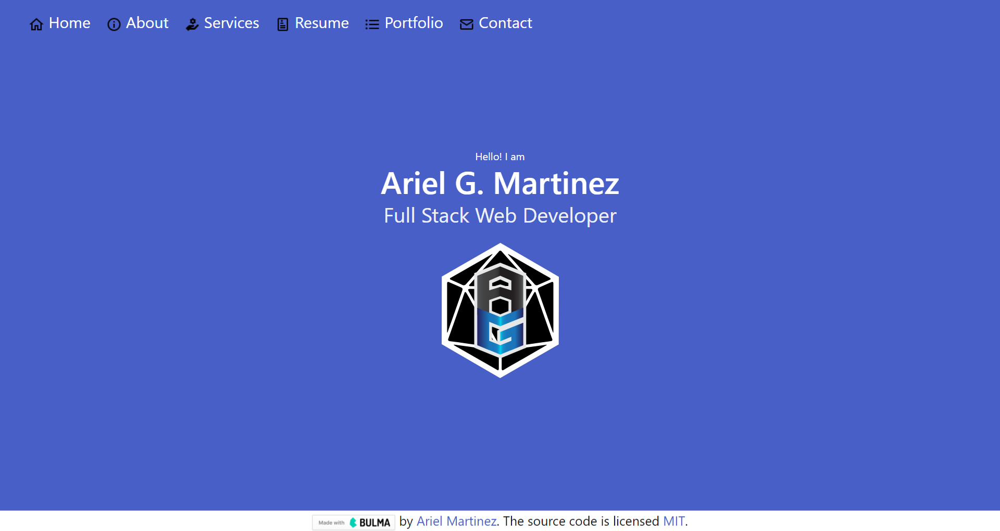
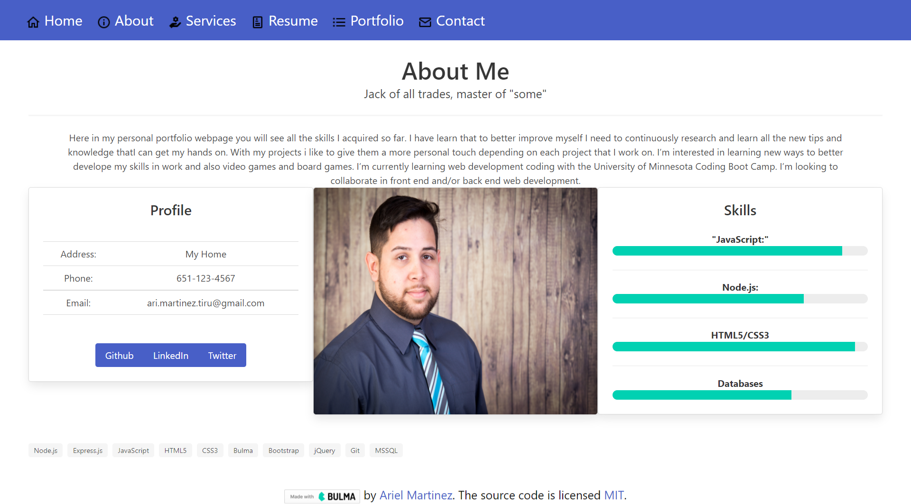
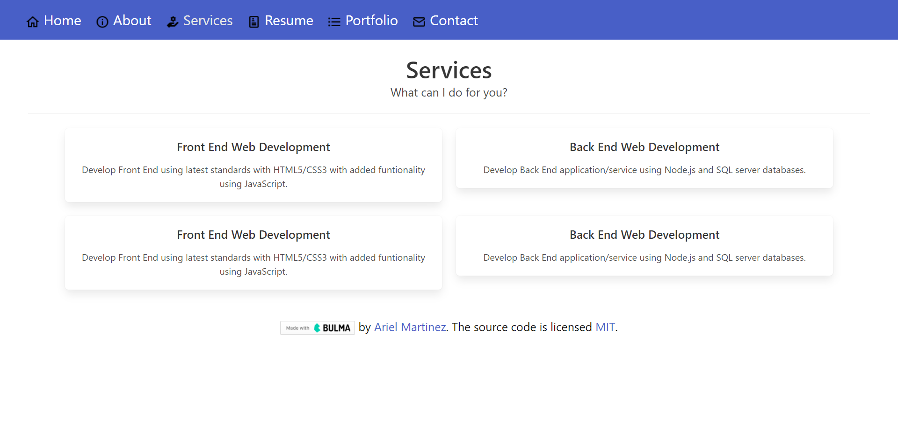

<h1 align="center">AG Portfolio React👋</h1>
  
<p align="center">
    
    
    
    
    <a href="https://github.com/arielo5"></a>
    
</p>

<p align="center">
    
    
    
    
</p>

## Description

🔍 The motivation for this project was to update my own personal portfolio webpage with all the skills I acquired so far. The reason for this is because to be able to sell myself to potential employers is to show them see what I can actually do with my skills and what I can provide to them. By using the new React skills, which will help set you apart from other developers whose portfolios don’t use the latest technologies. For this project I learn that to better improve myself I need to continuously learn all the new tips and knowledge that I can  implement in every project that I can get my hands on. With my projects i like to give them a more personal touch depending on each project that i work on.

**[Deployed Page](https://ag-portfolio-react.herokuapp.com/home)**

**[Github Profile](https://github.com/arielo5)** 

**[LinkIN Profile](https://www.linkedin.com/in/ariel-martinez-tiru/)**

💻 Below is a screenshot of the application:
  





## Usage

On the webpage you will see an Navbar Header buttons for each page, when you click on each one of the button it will open a tab for the to the corresponding pages. On each page it display all of my previous projects so far or info about mer, type of services, where to contact me and others. Also the page has a responsive layout that adapts to my viewport on various screens and devices.

   
## Table of Contents
- [Description](#description)
- [Usage](#usage)
- [Table of Contents](#table-of-contents)
- [Acceptance Criteria](#acceptance-criteria)
- [Questions](#questions)
- [License](#license)

 ## Acceptance Criteria
```md
GIVEN a single-page application portfolio for a web developer
WHEN I load the portfolio
THEN I am presented with a page containing a header, a section for content, and a footer
WHEN I view the header
THEN I am presented with the developer's name and navigation with titles corresponding to different sections of the portfolio
WHEN I view the navigation titles
THEN I am presented with the titles About Me, Portfolio, Contact, and Resume, and the title corresponding to the current section is highlighted
WHEN I click on a navigation title
THEN I am presented with the corresponding section below the navigation without the page reloading and that title is highlighted
WHEN I load the portfolio the first time
THEN the About Me title and section are selected by default
WHEN I am presented with the About Me section
THEN I see a recent photo or avatar of the developer and a short bio about them
WHEN I am presented with the Portfolio section
THEN I see titled images of six of the developer’s applications with links to both the deployed applications and the corresponding GitHub repositories
WHEN I am presented with the Contact section
THEN I see a contact form with fields for a name, an email address, and a message
WHEN I move my cursor out of one of the form fields without entering text
THEN I receive a notification that this field is required
WHEN I enter text into the email address field
THEN I receive a notification if I have entered an invalid email address
WHEN I am presented with the Resume section
THEN I see a link to a downloadable resume and a list of the developer’s proficiencies
WHEN I view the footer
THEN I am presented with text or icon links to the developer’s GitHub and LinkedIn profiles, and their profile on a third platform (Stack Overflow, Twitter)
``` 

## Questions
✉️ Contact me with any questions: [email](mailto:ari.martinez.tiru@gmail.com) , [GitHub](https://github.com/arielo5)<br/>

## License

  [](https://choosealicense.com/licenses/mit/)